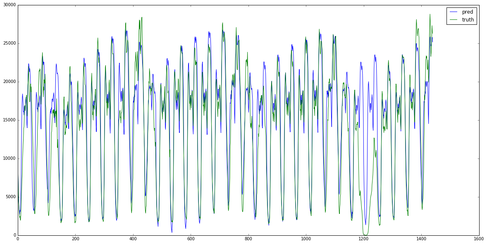
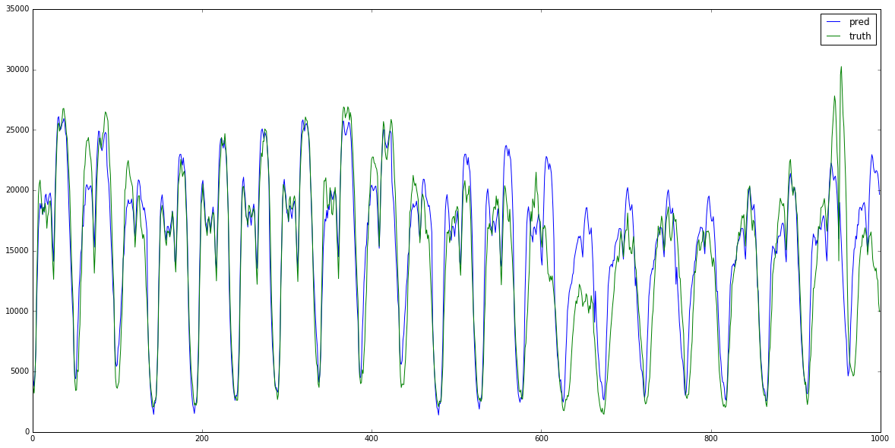

```python
import matplotlib.pyplot as plt
import pandas as pd
import numpy as np
from sklearn.preprocessing import RobustScaler

data = pd.read_csv('../data/nyc_taxi.csv')
data['timestamp'] = pd.to_datetime(data['timestamp'])
data.set_index('timestamp',inplace=True)

print data.index.dtype,len(data)

# use 7 days to predict 1 day
PRE_DAYS = 4
ONE_DAY_DATA_LEN = 48
def make_data(X, pre_days=PRE_DAYS):
    xs = []
    ys = []
    data_len = len(X)/ONE_DAY_DATA_LEN
    print data_len
    for i in range(data_len-PRE_DAYS):
        start_idx = i*ONE_DAY_DATA_LEN
        x = X[start_idx:start_idx+pre_days*ONE_DAY_DATA_LEN]
        y = X[start_idx+pre_days*ONE_DAY_DATA_LEN:start_idx+(1+pre_days)*ONE_DAY_DATA_LEN]
        xs.append(x)
        ys.append(y)
    return np.array(xs), np.array(ys)

scaler = RobustScaler()
daily_data = scaler.fit_transform(data.values.flatten())
print daily_data.shape
x,y = make_data(daily_data)
print x.shape,y.shape

def split_train_test(x, y, n):
    x_train, x_test = x[0:-n], x[-n:]
    y_train, y_test = y[0:-n], y[-n:]
    return x_train, y_train, x_test, y_test

X_train, Y_train, X_test, Y_test = split_train_test(x, y, 30)
print X_train.shape, Y_train.shape, X_test.shape, Y_test.shape
```

    datetime64[ns] 10320
    (10320,)
    215
    (211, 192) (211, 48)
    (181, 192) (181, 48) (30, 192) (30, 48)


    /usr/local/lib/python2.7/dist-packages/sklearn/preprocessing/data.py:965: DeprecationWarning: Passing 1d arrays as data is deprecated in 0.17 and will raise ValueError in 0.19. Reshape your data either using X.reshape(-1, 1) if your data has a single feature or X.reshape(1, -1) if it contains a single sample.
      warnings.warn(DEPRECATION_MSG_1D, DeprecationWarning)
    /usr/local/lib/python2.7/dist-packages/sklearn/preprocessing/data.py:987: DeprecationWarning: Passing 1d arrays as data is deprecated in 0.17 and will raise ValueError in 0.19. Reshape your data either using X.reshape(-1, 1) if your data has a single feature or X.reshape(1, -1) if it contains a single sample.
      warnings.warn(DEPRECATION_MSG_1D, DeprecationWarning)
    /usr/local/lib/python2.7/dist-packages/sklearn/preprocessing/data.py:965: DeprecationWarning: Passing 1d arrays as data is deprecated in 0.17 and will raise ValueError in 0.19. Reshape your data either using X.reshape(-1, 1) if your data has a single feature or X.reshape(1, -1) if it contains a single sample.
      warnings.warn(DEPRECATION_MSG_1D, DeprecationWarning)
    /usr/local/lib/python2.7/dist-packages/sklearn/preprocessing/data.py:1011: DeprecationWarning: Passing 1d arrays as data is deprecated in 0.17 and will raise ValueError in 0.19. Reshape your data either using X.reshape(-1, 1) if your data has a single feature or X.reshape(1, -1) if it contains a single sample.
      warnings.warn(DEPRECATION_MSG_1D, DeprecationWarning)


```python
from keras.models import Sequential
from keras.layers.core import Dense, Dropout, Activation
from keras.regularizers import l2, activity_l2

INPUT_LEN = ONE_DAY_DATA_LEN * PRE_DAYS
OUTPUT_LEN = 48

model = Sequential()
model.add(Activation('relu', input_shape=(INPUT_LEN,)))
model.add(Dense(INPUT_LEN, W_regularizer=l2(0.01), activity_regularizer=activity_l2(0.01)))
model.add(Activation('relu', input_shape=(INPUT_LEN,)))
model.add(Dense(INPUT_LEN/2))
model.add(Dropout(0.1))
model.add(Activation('relu', input_shape=(INPUT_LEN/2,)))
model.add(Dense(INPUT_LEN/4, W_regularizer=l2(0.01), activity_regularizer=activity_l2(0.01)))
model.add(Dropout(0.1))
model.add(Activation('linear', input_shape=(INPUT_LEN/4,)))
model.add(Dense(OUTPUT_LEN))

model.compile(loss='mse', optimizer='rmsprop')

print 'compile done'

model.fit(X_train, Y_train, nb_epoch=100, verbose=1, batch_size=50, validation_data=(X_test, Y_test))

print 'fit done'


```

    compile done
    Train on 181 samples, validate on 30 samples
    Epoch 1/100
    181/181 [==============================] - 0s - loss: 3.1335 - val_loss: 0.4735
    Epoch 2/100
    181/181 [==============================] - 0s - loss: 2.6009 - val_loss: 0.3716
    Epoch 3/100
    181/181 [==============================] - 0s - loss: 2.3132 - val_loss: 0.3190
    Epoch 4/100
    181/181 [==============================] - 0s - loss: 2.0956 - val_loss: 0.2887
    Epoch 5/100
    181/181 [==============================] - 0s - loss: 1.9194 - val_loss: 0.2587
    Epoch 6/100
    181/181 [==============================] - 0s - loss: 1.7720 - val_loss: 0.2417
    Epoch 7/100
    181/181 [==============================] - 0s - loss: 1.6217 - val_loss: 0.2282
    Epoch 8/100
    181/181 [==============================] - 0s - loss: 1.5113 - val_loss: 0.2200
    Epoch 9/100
    181/181 [==============================] - 0s - loss: 1.3946 - val_loss: 0.2060
    Epoch 10/100
    181/181 [==============================] - 0s - loss: 1.2873 - val_loss: 0.2040
    Epoch 11/100
    181/181 [==============================] - 0s - loss: 1.1826 - val_loss: 0.1900
    Epoch 12/100
    181/181 [==============================] - 0s - loss: 1.1042 - val_loss: 0.1904
    Epoch 13/100
    181/181 [==============================] - 0s - loss: 1.0190 - val_loss: 0.1783
    Epoch 14/100
    181/181 [==============================] - 0s - loss: 0.9510 - val_loss: 0.1759
    Epoch 15/100
    181/181 [==============================] - 0s - loss: 0.8764 - val_loss: 0.1724
    Epoch 16/100
    181/181 [==============================] - 0s - loss: 0.8109 - val_loss: 0.1695
    Epoch 17/100
    181/181 [==============================] - 0s - loss: 0.7633 - val_loss: 0.1785
    Epoch 18/100
    181/181 [==============================] - 0s - loss: 0.6994 - val_loss: 0.1665
    Epoch 19/100
    181/181 [==============================] - 0s - loss: 0.6611 - val_loss: 0.1752
    Epoch 20/100
    181/181 [==============================] - 0s - loss: 0.6041 - val_loss: 0.1603
    Epoch 21/100
    181/181 [==============================] - 0s - loss: 0.5678 - val_loss: 0.1563
    Epoch 22/100
    181/181 [==============================] - 0s - loss: 0.5333 - val_loss: 0.1560
    Epoch 23/100
    181/181 [==============================] - 0s - loss: 0.4956 - val_loss: 0.1724
    Epoch 24/100
    181/181 [==============================] - 0s - loss: 0.4691 - val_loss: 0.1555
    Epoch 25/100
    181/181 [==============================] - 0s - loss: 0.4334 - val_loss: 0.1619
    Epoch 26/100
    181/181 [==============================] - 0s - loss: 0.4113 - val_loss: 0.1598
    Epoch 27/100
    181/181 [==============================] - 0s - loss: 0.3968 - val_loss: 0.1711
    Epoch 28/100
    181/181 [==============================] - 0s - loss: 0.3680 - val_loss: 0.1435
    Epoch 29/100
    181/181 [==============================] - 0s - loss: 0.3398 - val_loss: 0.1361
    Epoch 30/100
    181/181 [==============================] - 0s - loss: 0.3326 - val_loss: 0.1460
    Epoch 31/100
    181/181 [==============================] - 0s - loss: 0.3114 - val_loss: 0.1587
    Epoch 32/100
    181/181 [==============================] - 0s - loss: 0.3024 - val_loss: 0.1277
    Epoch 33/100
    181/181 [==============================] - 0s - loss: 0.2918 - val_loss: 0.1585
    Epoch 34/100
    181/181 [==============================] - 0s - loss: 0.2639 - val_loss: 0.1349
    Epoch 35/100
    181/181 [==============================] - 0s - loss: 0.2526 - val_loss: 0.1440
    Epoch 36/100
    181/181 [==============================] - 0s - loss: 0.2433 - val_loss: 0.1571
    Epoch 37/100
    181/181 [==============================] - 0s - loss: 0.2586 - val_loss: 0.1532
    Epoch 38/100
    181/181 [==============================] - 0s - loss: 0.2225 - val_loss: 0.1374
    Epoch 39/100
    181/181 [==============================] - 0s - loss: 0.2114 - val_loss: 0.1417
    Epoch 40/100
    181/181 [==============================] - 0s - loss: 0.2291 - val_loss: 0.1237
    Epoch 41/100
    181/181 [==============================] - 0s - loss: 0.1970 - val_loss: 0.1172
    Epoch 42/100
    181/181 [==============================] - 0s - loss: 0.2000 - val_loss: 0.1926
    Epoch 43/100
    181/181 [==============================] - 0s - loss: 0.2026 - val_loss: 0.1305
    Epoch 44/100
    181/181 [==============================] - 0s - loss: 0.1920 - val_loss: 0.1540
    Epoch 45/100
    181/181 [==============================] - 0s - loss: 0.1895 - val_loss: 0.1238
    Epoch 46/100
    181/181 [==============================] - 0s - loss: 0.1671 - val_loss: 0.1259
    Epoch 47/100
    181/181 [==============================] - 0s - loss: 0.1910 - val_loss: 0.1397
    Epoch 48/100
    181/181 [==============================] - 0s - loss: 0.1649 - val_loss: 0.1324
    Epoch 49/100
    181/181 [==============================] - 0s - loss: 0.1564 - val_loss: 0.1673
    Epoch 50/100
    181/181 [==============================] - 0s - loss: 0.1651 - val_loss: 0.1165
    Epoch 51/100
    181/181 [==============================] - 0s - loss: 0.1473 - val_loss: 0.1586
    Epoch 52/100
    181/181 [==============================] - 0s - loss: 0.1673 - val_loss: 0.1265
    Epoch 53/100
    181/181 [==============================] - 0s - loss: 0.1492 - val_loss: 0.1228
    Epoch 54/100
    181/181 [==============================] - 0s - loss: 0.1388 - val_loss: 0.1253
    Epoch 55/100
    181/181 [==============================] - 0s - loss: 0.1423 - val_loss: 0.1469
    Epoch 56/100
    181/181 [==============================] - 0s - loss: 0.1430 - val_loss: 0.1178
    Epoch 57/100
    181/181 [==============================] - 0s - loss: 0.1295 - val_loss: 0.1121
    Epoch 58/100
    181/181 [==============================] - 0s - loss: 0.1585 - val_loss: 0.1280
    Epoch 59/100
    181/181 [==============================] - 0s - loss: 0.1301 - val_loss: 0.1358
    Epoch 60/100
    181/181 [==============================] - 0s - loss: 0.1229 - val_loss: 0.1391
    Epoch 61/100
    181/181 [==============================] - 0s - loss: 0.1621 - val_loss: 0.1549
    Epoch 62/100
    181/181 [==============================] - 0s - loss: 0.1239 - val_loss: 0.1164
    Epoch 63/100
    181/181 [==============================] - 0s - loss: 0.1147 - val_loss: 0.1165
    Epoch 64/100
    181/181 [==============================] - 0s - loss: 0.1175 - val_loss: 0.1253
    Epoch 65/100
    181/181 [==============================] - 0s - loss: 0.1146 - val_loss: 0.1279
    Epoch 66/100
    181/181 [==============================] - 0s - loss: 0.1280 - val_loss: 0.1700
    Epoch 67/100
    181/181 [==============================] - 0s - loss: 0.1272 - val_loss: 0.1488
    Epoch 68/100
    181/181 [==============================] - 0s - loss: 0.1072 - val_loss: 0.1045
    Epoch 69/100
    181/181 [==============================] - 0s - loss: 0.1107 - val_loss: 0.1832
    Epoch 70/100
    181/181 [==============================] - 0s - loss: 0.1316 - val_loss: 0.1176
    Epoch 71/100
    181/181 [==============================] - 0s - loss: 0.1077 - val_loss: 0.1142
    Epoch 72/100
    181/181 [==============================] - 0s - loss: 0.1043 - val_loss: 0.1237
    Epoch 73/100
    181/181 [==============================] - 0s - loss: 0.1098 - val_loss: 0.1245
    Epoch 74/100
    181/181 [==============================] - 0s - loss: 0.1187 - val_loss: 0.1321
    Epoch 75/100
    181/181 [==============================] - 0s - loss: 0.1013 - val_loss: 0.1314
    Epoch 76/100
    181/181 [==============================] - 0s - loss: 0.1113 - val_loss: 0.1218
    Epoch 77/100
    181/181 [==============================] - 0s - loss: 0.0980 - val_loss: 0.1616
    Epoch 78/100
    181/181 [==============================] - 0s - loss: 0.1122 - val_loss: 0.1623
    Epoch 79/100
    181/181 [==============================] - 0s - loss: 0.1117 - val_loss: 0.1307
    Epoch 80/100
    181/181 [==============================] - 0s - loss: 0.0901 - val_loss: 0.1210
    Epoch 81/100
    181/181 [==============================] - 0s - loss: 0.1032 - val_loss: 0.1921
    Epoch 82/100
    181/181 [==============================] - 0s - loss: 0.1242 - val_loss: 0.1256
    Epoch 83/100
    181/181 [==============================] - 0s - loss: 0.1008 - val_loss: 0.1311
    Epoch 84/100
    181/181 [==============================] - 0s - loss: 0.0866 - val_loss: 0.1052
    Epoch 85/100
    181/181 [==============================] - 0s - loss: 0.0997 - val_loss: 0.1189
    Epoch 86/100
    181/181 [==============================] - 0s - loss: 0.0886 - val_loss: 0.1666
    Epoch 87/100
    181/181 [==============================] - 0s - loss: 0.0922 - val_loss: 0.1516
    Epoch 88/100
    181/181 [==============================] - 0s - loss: 0.1383 - val_loss: 0.1160
    Epoch 89/100
    181/181 [==============================] - 0s - loss: 0.0849 - val_loss: 0.1163
    Epoch 90/100
    181/181 [==============================] - 0s - loss: 0.0861 - val_loss: 0.1163
    Epoch 91/100
    181/181 [==============================] - 0s - loss: 0.1051 - val_loss: 0.1303
    Epoch 92/100
    181/181 [==============================] - 0s - loss: 0.0944 - val_loss: 0.1280
    Epoch 93/100
    181/181 [==============================] - 0s - loss: 0.0967 - val_loss: 0.1222
    Epoch 94/100
    181/181 [==============================] - 0s - loss: 0.0848 - val_loss: 0.1120
    Epoch 95/100
    181/181 [==============================] - 0s - loss: 0.0827 - val_loss: 0.1282
    Epoch 96/100
    181/181 [==============================] - 0s - loss: 0.1245 - val_loss: 0.1193
    Epoch 97/100
    181/181 [==============================] - 0s - loss: 0.0787 - val_loss: 0.1065
    Epoch 98/100
    181/181 [==============================] - 0s - loss: 0.0853 - val_loss: 0.1250
    Epoch 99/100
    181/181 [==============================] - 0s - loss: 0.0906 - val_loss: 0.1383
    Epoch 100/100
    181/181 [==============================] - 0s - loss: 0.1021 - val_loss: 0.1605
    fit done


## on test data set


```python
%matplotlib inline
import matplotlib.pyplot as plt

plt.figure(figsize=(20,10))
pred = model.predict(X_test)
pred = scaler.inverse_transform(pred.reshape(-1,1))
truth = scaler.inverse_transform(Y_test.reshape(-1,1))

from sklearn import metrics

print metrics.explained_variance_score(truth,pred)
print metrics.r2_score(truth,pred)
print metrics.mean_absolute_error(truth,pred),truth.mean(),truth.std()

plt.plot(pred,label='pred')
plt.plot(truth,label='truth')
plt.legend()
plt.show()


```

    0.753815189259
    0.727868072789
    2392.79627224 14400.3347222 7354.23979249





## on train data set


```python
pred = model.predict(X_train)
%matplotlib inline
import matplotlib.pyplot as plt
plt.figure(figsize=(20,10))

pred = scaler.inverse_transform(pred.reshape(-1,1))
truth = scaler.inverse_transform(Y_train.reshape(-1,1))
# pred = pred.flatten()
# truth = Y_test.flatten()

from sklearn import metrics

print metrics.explained_variance_score(truth,pred)
print metrics.r2_score(truth,pred)
print metrics.mean_absolute_error(truth,pred),truth.mean(),truth.std()

plt.plot(pred[-1000:],label='pred')
plt.plot(truth[-1000:],label='truth')
plt.legend()
plt.show()
```

    0.914691873885
    0.910328101407
    1443.6742534 15278.6510129 6865.64876215




